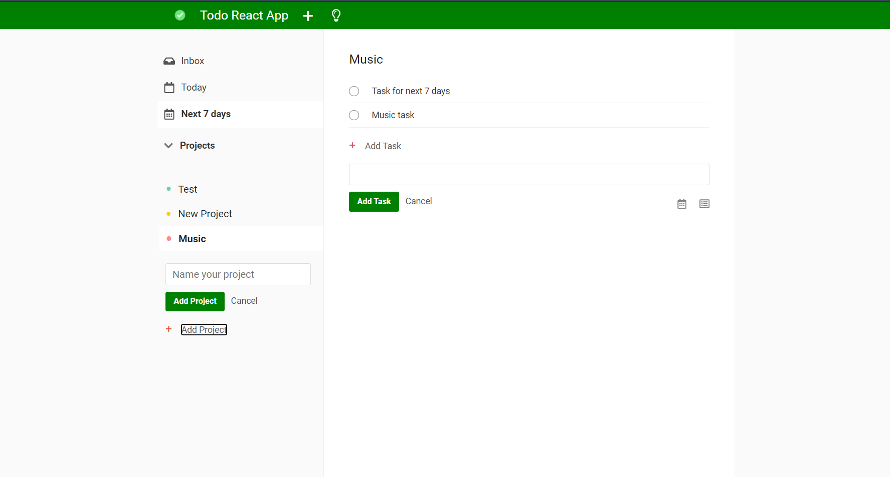

# To-Do React App
> A simplified version of To-Do app created in React

## Table of contents
* [General info](#general-info)
* [Screenshots](#screenshots)
* [Technologies](#technologies)
* [Setup](#setup)
* [Features](#features)
* [Status](#status)
* [Contact](#contact)

## General info
This is a simplified version of To-Do app. You can create projects, add your simple tasks, assign them to the projects and plan them for today/next 7 days. This web application is fully responsible and uses React hooks. There is also a dark mode feature! :)

## Screenshots

  

## Technologies
Back-end:
* REST API from Cloud Firestore - version 8.2.1
* Firebase database - version 8.2.1

Front-end:
* Bootstrap - version 4.5.3
* Node-sass - version 4.14.1
* React - version 17
* React-dom - version 17
* React-icons - version 4.1.0
* Moment - version 2.24.0

## Setup
All you have to do is to go to the main directory, install all the necessary dependencies by running npm install and then just run the project by entering npm run start command. Then you will be able to use the project in your browser.

## Features
List of features ready:
* Adding project
* Adding tasks
* Assigning the tasks to the project
* Estimating the tasks for today/tomorrow/next 7 days
* Dark mode
* Responsive layout

## Status
Project is: _finished_.

## Contact
Created by [Piotr Buczek](mailto:piotr.buczek37@gmail.com?subject=[GitHub]%20Todo-react-app) and [Bartosz Bryła](mailto:gotimus@gmail.com?subject=[GitHub]%20Todo-react-app)- feel free to contact us!
